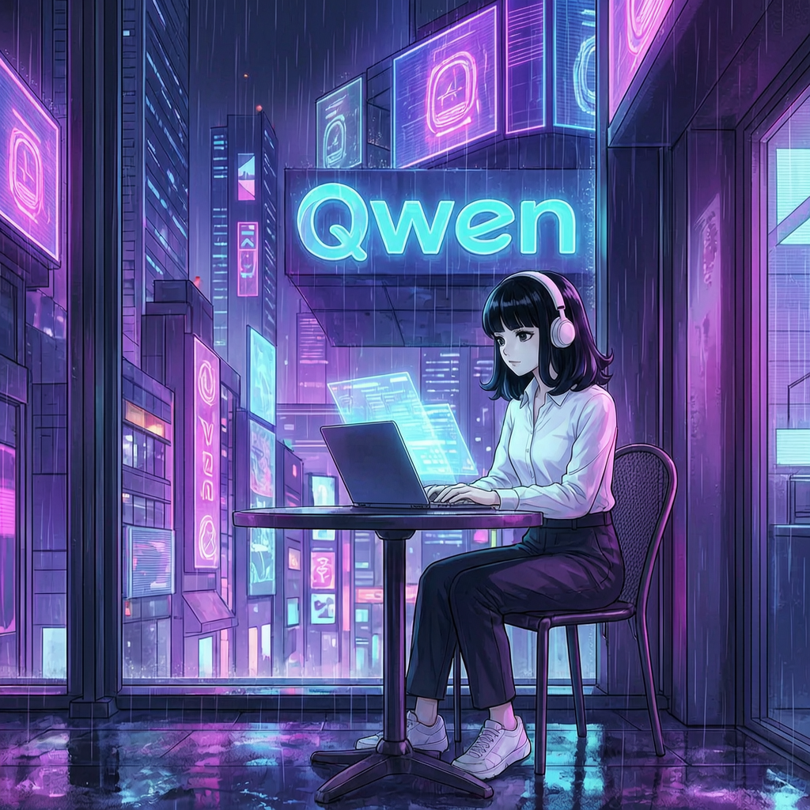

# hermes-plugin-dashscope-image

Image generation plugin for [Hermes Agent](https://github.com/NousResearch/hermes-agent) using Alibaba Cloud DashScope (Qwen Cloud).

Brings Alibaba's Wan 2.7 image models to Hermes's `image_generate` tool. Works with both token plan keys (`sk-sp-*`) and pay-as-you-go keys (`sk-ws-*`).

## Example

Image-to-image generation with `wan2.7-image-pro` -- anime character placed into a cyberpunk cityscape with Qwen neon signage:



## Models

| Model | Strengths |
|-------|-----------|
| `wan2.7-image` | Fast text-to-image (~5s) |
| `wan2.7-image-pro` | Higher fidelity, image-to-image editing (~10s) |

Both models are included in the Alibaba Cloud AI Token Plan subscription and are available on the PAYG free tier.

## Install

```bash
hermes plugins install rriggs/hermes-plugin-dashscope-image
hermes plugins enable dashscope
```

## Configure

All configuration lives under `image_gen.dashscope` in `config.yaml`:

```yaml
image_gen:
  provider: dashscope
  dashscope:
    api: https://token-plan.ap-southeast-1.maas.aliyuncs.com
    key_env: QWEN_API_KEY
    model: wan2.7-image          # optional
```

| Key | Default | Description |
|-----|---------|-------------|
| `api` | `https://token-plan.ap-southeast-1.maas.aliyuncs.com` | DashScope API base URL |
| `key_env` | `QWEN_API_KEY` | Name of the env var holding your API key |
| `model` | `wan2.7-image` | Default model for generation |

Set the API key in your `.env` file:

```bash
QWEN_API_KEY=***
```

### PAYG users

```yaml
image_gen:
  provider: dashscope
  dashscope:
    api: https://dashscope-intl.aliyuncs.com
    key_env: DASHSCOPE_API_KEY
```

No env var names are hard-coded -- `key_env` tells the plugin which env var to read.

## Usage

Once configured, Hermes's `image_generate` tool routes through DashScope automatically:

- **Text-to-image**: just provide a prompt
- **Image-to-image**: provide `image_url` (auto-upgrades to wan2.7-image-pro)
  - Accepts URLs (`https://...`), data URIs (`data:image/png;base64,...`), or local file paths (`/path/to/image.png`) -- local files are automatically base64-encoded inline

Generated images are cached locally under `$HERMES_HOME/cache/images/` since DashScope OSS URLs expire after ~24 hours.

## API Details

This plugin uses the native DashScope multimodal-generation API:

```
POST {api}/api/v1/services/aigc/multimodal-generation/generation
```

The OpenAI-compatible `/images/generations` endpoint is NOT used because the token plan endpoint does not serve image models on that path.

## Requirements

- Hermes Agent v0.18+
- API key set in the env var named by `key_env`
- `requests` Python package (bundled with Hermes)

## License

MIT
